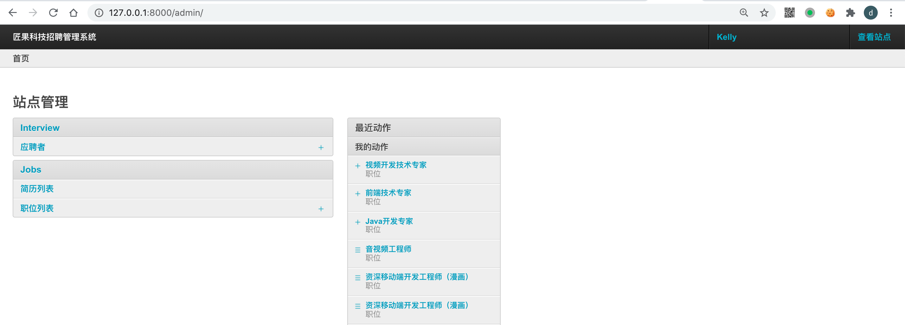
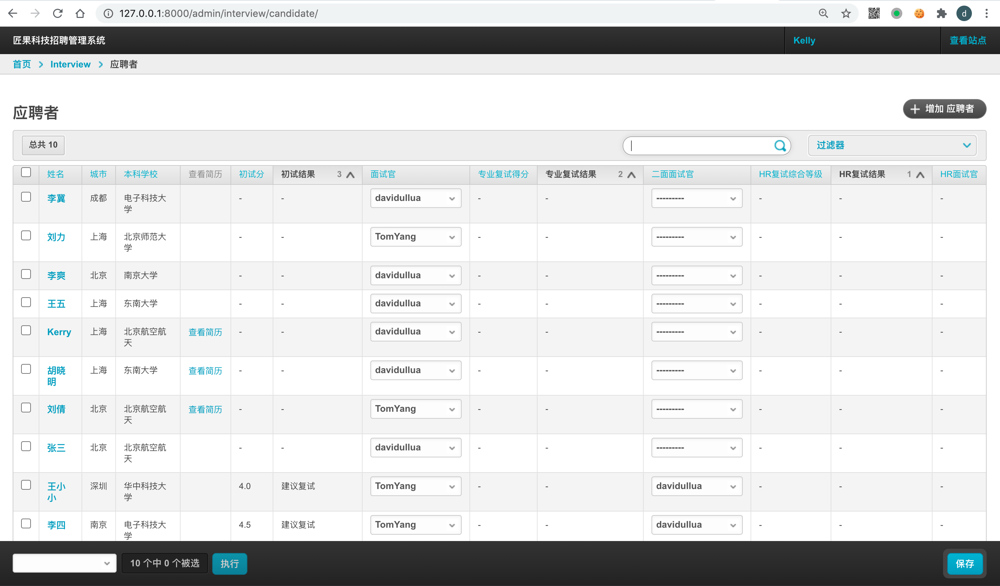
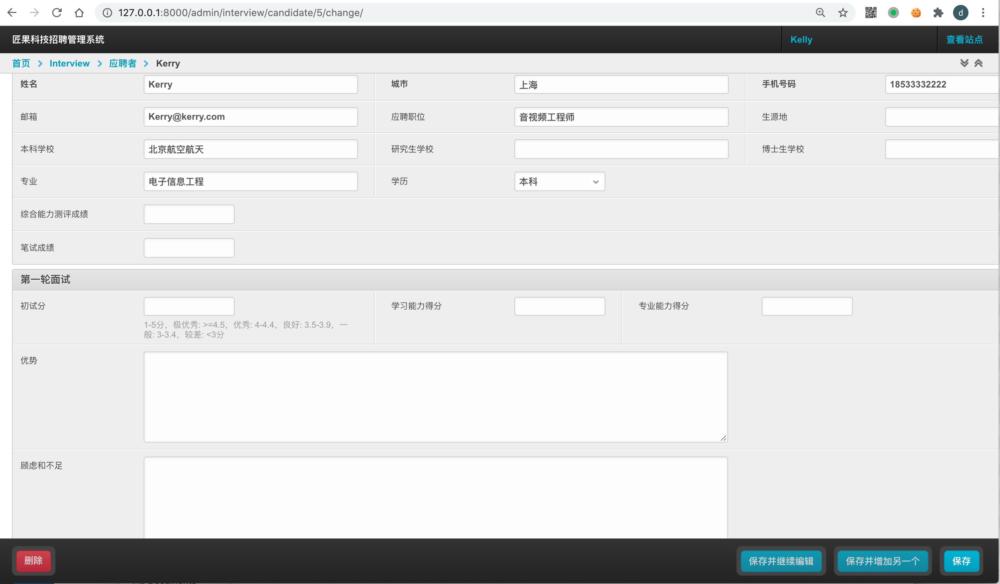
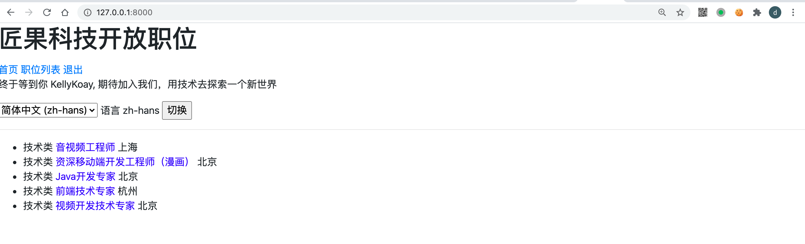
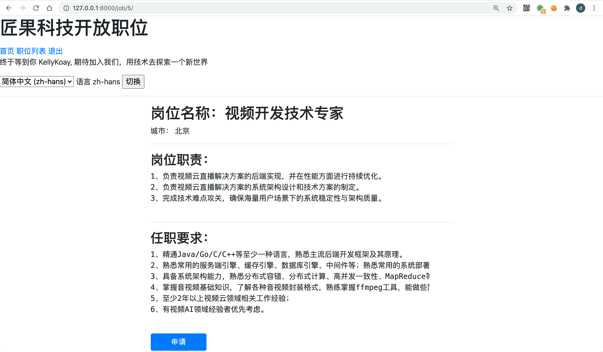

## 匠果招聘：项目说明

用做创业公司职位发布，简历投递，招聘管理的开源项目，基于高效的Django & Python开发。
优秀的产品经理，能够做好迭代版本规划。

最初，这是一个使用 Python Django 两天开发出来的项目，经过逐步完善可以满足不同企业的招聘管理需求。
可集成企业域账号、发布职位、候选人可以投递简历、可以在面试过程中评估简历。 可以导入，导出候选人数据。

面试通知跟 钉钉群集成。

## 项目效果

招聘后台 - 首页

招聘后台 - 候选人列表

招聘系统后台 - 评估候选人

对外招聘网站 - 职位列表

对外招聘网站 - 申请职位

